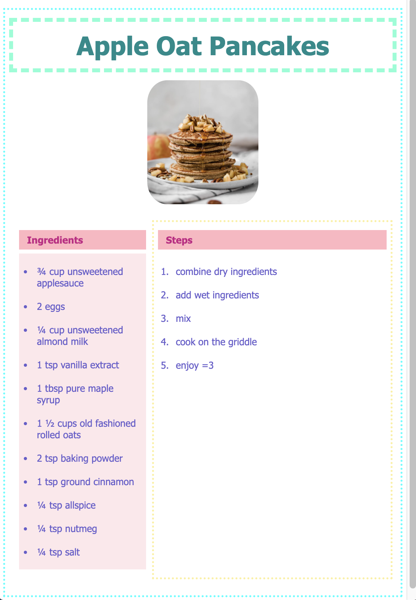

# Odin Recipes
*The Odin Project *
https://www.theodinproject.com/lessons/foundations-recipes

Odin recipes is a website that will display recipes and images.

> ## Skills:
> - basic HTML
> - basic CSS
> - flexbox

## Home Page

## Recipe Page

## Sections
- Header (Navigation Bar)
- Hero
- Info
- Quote
- Footer

# TODO:
- update images
- create collapsing navigation menu
    - bfast section?
    - 

## Steps Taken
- Set up repository
- create README, index, css files
- auto-fill html (!) and link to css file
.
.
.
- add navigation bar
- 
